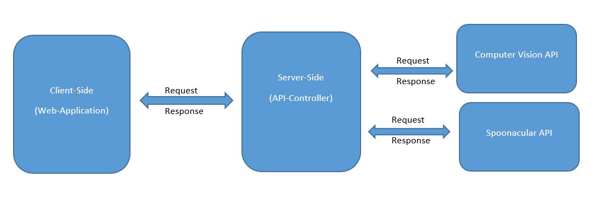

# Good Food Cloud App

<p align="center"></p>

## Introducere 
<p>Aplicatia dezolvata are ca scop oferirea unor idei de retete pe baza ingredientelor pe care utilizatorul le incarca printr-o poza specifica. Poza incarcata poate fi un fisier din calculatorul personal sau o adresa URL.</p>
<p>Prin apasarea functionalitatii de vizualizare detalii despre o reteta, se va afisa o lista de informatii suplimentare precum: timp de preparare, costul, numarul de portii, ingredientele necesare, o scurta descriere si de asemenea, o lista de nutrieni, printre care se afla si numarul de calorii, fiind in multe cazuri un factor decizional in alegerea gospodinelor/bucatarilor.</p>
<p>Aplicatia se adreseaza tuturor categoriilor de utilizatori, indiferent de sex, care vor sa incerce retete noi cu alimentele ce le au la indemana.</p>


## Descriere Problema 
Ideea aplicatiei a pornit de la faptul ca multi dintre noi se afla in situatia in care avem anumite alimente in frigider, insa nu stim ce putem gati cu acestea. Astfel, aceste alimente sfarsesc prin a se strica sau a expira, ajungand in cele din urma, la cosul de gunoi.
<p>Aplicatia sporeste creativitatea utilizatorilor prin multitudinea de retete oferite, si diminueaza risipa de hrana, avand un impact pozitiv asupra mediului.</p>

## Descriere API
Aplicatia este dezvoltata in ASP.NET. Partea de front-end contine o interfata scrisa in HTML, CSS, JavaScript, iar partea de back-end scrisa in C# permite accesul la datele din 2 API-uri(Computer Vision de la Microsoft si Spoonacular) prin request si response.
<h4>Computer Vision API</h4>
<p>Pe caz particular, am folosit acest api pentru recunoasterea numelui ingredientului introdus de utilizator fie prin poza locala, fie prin URL.</p>
<p>Tin sa mentionez ca acest API nu este unul foarte exact, iar ingredientele pe care am testat si sunt recunoscute cu succes: para, mar, portocala, carne, peste. </p>
<div style="display: inline-block">


</div>

<p>De asemenea, aceasta recunoastere a imaginii tine si formatul pozei( cele suportate sunt: JPEG, PNG, GIF, BMP), de marimea pozei (cel putin 50x50) si de dimensiunea ei ( mai putin de 4 MB).</p>

Request-ul este realizat prin urmatoarele linii de cod:
```C#
client.DefaultRequestHeaders.Add("Ocp-Apim-Subscription-Key", subscriptionKey);
client.DefaultRequestHeaders.Accept.Add(new MediaTypeWithQualityHeaderValue("application/octet-stream"));

var content = new ByteArrayContent(localImage.FileBytes);
content.Headers.ContentType = new MediaTypeHeaderValue("application/octet-stream");

var result = client.PostAsync(endpoint + "vision/v3.0/detect", content).Result;
```
		
<p>Acest API necesita autentificarea printr-o cheie unica. GET-ul se realizeaza prin concatenarea endpoint cu versiunea api-ului si content-ul care poate fi o imagine locala sau din URL(aplicatia are 2 metode separate pentru fieccare tip de upload).</p>

Response-ul este un JSON pe care il deserializam si il introducem intr-o lista de ingrediente.
```C#
responseData = result.Content.ReadAsStringAsync().Result;
dynamic dynamicJson = JsonConvert.DeserializeObject(responseData.ToString());

foreach (var receipe in dynamicJson["objects"])
{
	var receipeElement = receipe["object"];
	if (ingredientsForReceipe.Contains(receipeElement))
	{
		continue;
	}
	ingredientsForReceipe.Add(receipeElement);
}
```
Exemplu JSON:
```JSON
[
	{
      "objects":[
         {
            "rectangle":{
               "x":31,
               "y":154,
               "w":430,
               "h":706
            },
            "object":"Pear",
            "confidence":0.547,
            "parent":{
               "object":"Fruit",
               "confidence":0.548,
               "parent":{
                  "object":"Food",
                  "confidence":0.548
               }
            }
         },
         {
            "rectangle":{
               "x":483,
               "y":308,
               "w":535,
               "h":543
            },
            "object":"Apple",
            "confidence":0.858,
            "parent":{
               "object":"Fruit",
               "confidence":0.876,
               "parent":{
                  "object":"Food",
                  "confidence":0.877
               }
            }
         }
      ],
      "requestId":"60bfaa7f-b29f-4155-8ac6-dcb7c49ed521",
      "metadata":{
         "height":899,
         "width":1023,
         "format":"Jpeg"
      }
   }
]
```

<h4>Spoonacular API </h4>
<p>Este un API specializat pentru alimente si are ca functionalitati Analiza retelor, Gestionarea Retetelor si Planificarea meselor. </p>
<p>Functionalitatile folosite sunt: </p>

1. Cautarea retetelor dupa ingrediente

<p>Daca te-ai intrebat vreodata ce poti gati cu ingredientele pe care la ai in frigider sau camara, spoonacular ofera retete care fie maximizeaza utilizearea ingredientelor pe care le aveti la indemana, fie minimeaza ingredientele pe care nu le aveti in prezent.
Acest API este utilizat in special in aplicatiile de tipul "What's in your fridge". </p>
Exemplu de request:

```C#
var baseAddress = "https://api.spoonacular.com/";
var queryParams = new Dictionary<string, string>()
{
	{ "ingredients", ingredients },
	{ "number", "6" },
	{ "apiKey", "48459edeaadf4a27a8d1e5bc8f0796a4" }
};
var url = QueryHelpers.AddQueryString(baseAddress + "recipes/findByIngredients", queryParams);
```

Putem observa ca acest api necesita autentificarea printr-un apiKey si trebuie sa ii dam ca parametri denumirea ingredientelor si numarul de retete pe care dorim sa ni le afiseze.
<p>Caz particular:</p>

```
GET: https://api.spoonacular.com/recipes/findByIngredients?ingredients=Pear,+Apple&number=6&apiKey=48459edeaadf4a27a8d1e5bc8f0796a4
```

Response-ul va fi un JSON pe care l-am deserializat si introdus intr-un listview.

```C#
var responseTask = client.GetAsync(url);
responseTask.Wait();

var result = responseTask.Result;
if (result.IsSuccessStatusCode)
{
	responseData = result.Content.ReadAsStringAsync().Result;
	dynamic dynamicJson = JsonConvert.DeserializeObject(responseData.ToString());
	receipeList.DataSource = dynamicJson;
	receipeList.DataBind();
}
```
Exemplu JSON:

```JSON
[
   {
      "id":638779,
      "title":"Chobani Harvest Fruit Salad",
      "image":"https://spoonacular.com/recipeImages/638779-312x231.jpg",
      "imageType":"jpg",
      "usedIngredientCount":3,
      "missedIngredientCount":9,
      "missedIngredients":[
         {
            "id":9040,
            "amount":1.0,
            "unit":"",
            "unitLong":"",
            "unitShort":"",
            "aisle":"Produce",
            "name":"banana",
            "original":"1 banana, sliced",
            "originalString":"1 banana, sliced",
            "originalName":"banana, sliced",
            "metaInformation":[
               "sliced"
            ],
            "meta":[
               "sliced"
            ],
            "image":"https://spoonacular.com/cdn/ingredients_100x100/bananas.jpg"
         },
		 
		....
		]
		...
    }
]
```

2. Oferirea de detalii suplimentare a unei retete generate anterior pe baza id-ului acesteia.
	
```C#
var baseAddress = "https://api.spoonacular.com/";
var queryParams = new Dictionary<string, string>()
{
	{ "includeNutrition", "true" },
	{ "apiKey", "48459edeaadf4a27a8d1e5bc8f0796a4" }
};
var url = QueryHelpers.AddQueryString(baseAddress + "recipes/" + receipeId + "/information", queryParams);
```
<p>Caz particular: </p>

```
GET: https://api.spoonacular.com/recipes/642554/information?includeNutrition=true&apiKey=48459edeaadf4a27a8d1e5bc8f0796a4
```

Response-ul va fi tot un JSON pe care l-am tratat in acest mod:

```C#	
var responseTask = client.GetAsync(url);
responseTask.Wait();
var result = responseTask.Result;
if (result.IsSuccessStatusCode) {
	responseData = result.Content.ReadAsStringAsync().Result;
	dynamicJson = JsonConvert.DeserializeObject(responseData.ToString());
}
```			
<p>Exemplu JSON:</p>

```JSON
[
   {
      "id":2048,
      "aisle":"Oil, Vinegar, Salad Dressing",
      "image":"apple-cider-vinegar.jpg",
      "consistency":"liquid",
      "name":"apple cider vinegar",
      "nameClean":"apple cider vinegar",
      "original":"1/4 cup apple cider vinegar",
      "originalString":"1/4 cup apple cider vinegar",
      "originalName":"apple cider vinegar",
      "amount":0.25,
      "unit":"cup",
      "meta":[
         
      ],
      "metaInformation":[
         
      ],
      "measures":{
         "us":{
            "amount":0.25,
            "unitShort":"cups",
            "unitLong":"cups"
         },
         "metric":{
            "amount":59.147,
            "unitShort":"ml",
            "unitLong":"milliliters"
         }
      }
   },
   ....
]
```	
## Flux de date




## Interfețe aplicație

<p> Pagina de HOME</p>

Dupa upload-ul imaginii, se afiseaza response-ul api-ului de recunoastere de imagini si afisare de retete.


Daca dam click pe o reteta, ni se vor afisa informatii suplimentare despre aceasta, printr-un alt call de API.


